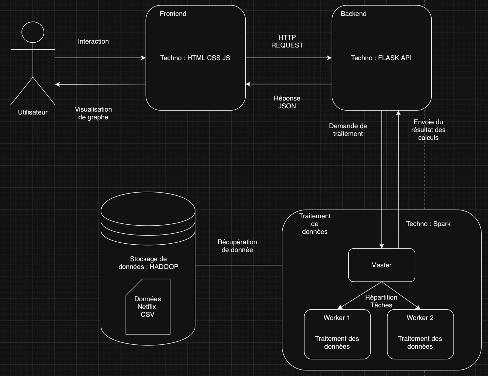

# BIG DATA PROJECT : Interaction avec les données de Netflix

## SOMMAIRE

1. Introduction
2. Installation et Configuration
3. Utilisation du site

## 1. INTRODUCTION

### Description du projet

Ce projet de Big Data et de visualisation vise à analyser des données provenant de la plateforme Netflix. En utilisant des technologies de traitement de données massives comme Hadoop et Spark, nous pouvons traiter efficacement un large ensemble de données, tout en offrant des visualisations interactives à l’utilisateur via une interface web conviviale.

Le projet se décompose en trois parties principales :
- Backend de traitement des données : une API Python (Flask) interagit avec Spark pour récupérer les données traitées.
- Cluster Hadoop : un environnement distribué composé d’un nœud maître et de deux nœuds workers pour gérer le stockage et le traitement des données via HDFS et Spark.
- Interface Frontend : un dashboard web (HTML/CSS/JavaScript) permettant d’afficher les résultats sous forme de graphiques interactifs.

### Objectifs

L’objectif principal de ce projet est de démontrer comment exploiter les technologies Big Data pour analyser des datasets volumineux dans un environnement distribué. En particulier, nous utilisons les données de Netflix, qui comprennent des milliers de films et séries télévisées, pour répondre à des questions telles que :

- Quels sont les pays les plus représentés sur la plateforme ?
- Quel est le ratio entre les films et les séries ?
- Comment les contenus se répartissent-ils au fil des années ?

Grâce à Hadoop et Spark, ces analyses sont réalisées de manière efficace, même avec un large volume de données. Le résultat final est ensuite rendu accessible à l’utilisateur sous forme de visualisations graphiques via une interface web.

### Technologies utilisées

Le projet s’appuie sur une combinaison de technologies pour assurer une architecture robuste et scalable :

- Hadoop : pour le stockage distribué des données avec YARN et HDFS.	
- Spark : pour le traitement rapide des données en mémoire.
- Flask : un micro-framework Python pour développer une API RESTful, permettant l’interaction avec Spark et le traitement des données.
- Docker : pour conteneuriser l’environnement, simplifiant ainsi le déploiement sur différentes machines.
- HTML CSS JS : Affichage du site
- Chart.js : pour créer des visualisations interactives et dynamiques des résultats.



### 2. Installation et configuration

Cette section vous guide à travers les étapes simples pour installer et configurer l’environnement de ce projet. L’objectif est de rendre l’application opérationnelle localement via Docker, en quelques commandes seulement.

### Prérequis

Avant de commencer, assurez-vous que les éléments suivants sont installés sur votre machine :

- Docker : Docker est utilisé pour créer des conteneurs qui isolent les différents composants du projet. Installer [Docker](https://docs.docker.com/get-started/get-docker/)
- Docker Compose : Utilisé pour orchestrer et gérer les multiples conteneurs nécessaires pour exécuter le projet. Installer [Docker Compose](https://docs.docker.com/compose/install/)

### Installation

Étapes :

- Clonage du dépôt du projet :
  Ouvrez un terminal et exécutez la commande suivante pour cloner le dépôt du projet sur votre machine :
```
  git clone https://github.com/Btxgear/BIG_DATA_EVALUATION.git
```

- Accédez au répertoire du projet :
  Une fois le dépôt cloné, accédez au répertoire principal du projet en utilisant la commande cd : 
```
  cd BIG_DATA_EVALUATION
```
- Démarrer les services avec Docker Compose
  Pour lancer tous les services du projet (Hadoop, Backend, Frontend, etc.), exécutez simplement la commande suivante :
```
  docker-compose up
```
Cette commande télécharge les images Docker nécessaires, les construit si besoin, et démarre les conteneurs définis dans le fichier docker-compose.yml.

### Configuration

Le fichier docker-compose.yml configure tous les services nécessaires au projet. Voici un aperçu des principaux services :

- Hadoop Cluster : Contient un master et deux workers qui sont lancés automatiquement. Ils communiquent entre eux pour traiter les données via Spark et Hadoop.
- Backend (API Flask) : Ce service expose une API Python via Flask, qui interagit avec Hadoop pour récupérer les données.
- Frontend : Ce service Nginx sert l’interface utilisateur pour visualiser les résultats des analyses de données.

Aucun fichier de configuration supplémentaire n’est requis pour le lancement du projet, tout est géré automatiquement par Docker et Docker Compose.

### Accès aux services

Une fois que Docker Compose a démarré tous les services, vous pouvez y accéder via les adresses suivantes :

- Frontend (interface utilisateur) : Disponible sur http://localhost, cette interface permet de visualiser les analyses de données sous forme de graphiques.
- Backend (API Flask) : L’API est disponible sur http://localhost:5000 pour interagir avec les données traitées.

### Arrêt des services

Pour arrêter tous les services, il suffit de revenir dans le terminal où docker-compose up a été lancé et d’utiliser CTRL + C. Vous pouvez également arrêter les conteneurs en arrière-plan avec la commande suivante :
```
docker-compose down
```
Cela arrête tous les conteneurs et libère les ressources utilisées.

Cette section vous donne une vue claire et concise des étapes d’installation et de configuration. Grâce à Docker, le déploiement est simple et ne nécessite que quelques commandes pour rendre l’application opérationnelle.

## 3. Utilisation du site

Allez sur http://localhost.

Voici à quoi devrait ressembler le site : 


Le site contient une seule page qui possède 5 différents graphes permettant de répondre à nos objectifs, de visualiser de manière esthétique les données, de télécharger des fichiers .csv pour chaque graphes et enfin de télécharger le dataset complet de nos données.
